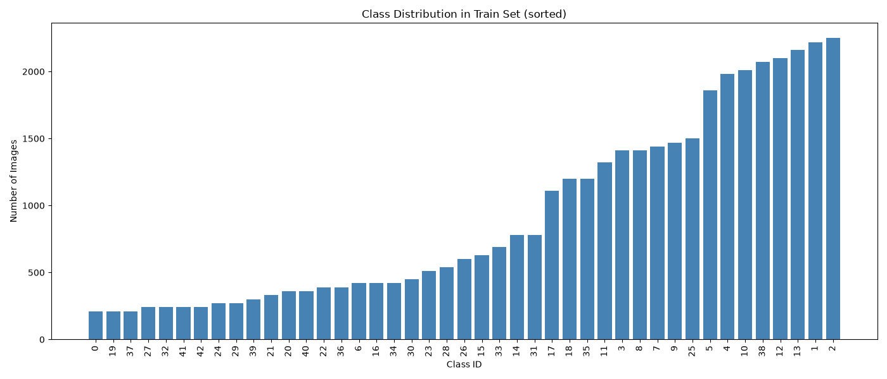

# Tackling Class Imbalance in Traffic Sign Recognition (GTSRB)

**A controlled comparison of 4 imbalance-mitigation strategies on a 43-class CNN classifier**

Click here for [detailed reprts](https://github.com/sayyedmujtaba/Traffic-Signs-Recognition/settings)

## The Problem

The [German Traffic Sign Recognition Benchmark (GTSRB)](https://www.kaggle.com/datasets/meowmeowmeowmeowmeow/gtsrb-german-traffic-sign) is a widely-used dataset for traffic sign classification — but it has a real-world flaw that most tutorials gloss over: **severe class imbalance**. The most common sign class has 2,250 training images; the rarest have just 210 — a ~10.7:1 ratio.

Standard training on this dataset yields ~97% overall accuracy — a number that looks great but hides a critical weakness: models can achieve high accuracy while completely failing on rare classes, simply because those classes barely affect the aggregate score.

**Research question:** *Do common class-imbalance mitigation techniques actually fix this — and what do they trade off in return?*

## Approach

To isolate the effect of each technique, every experiment used:
- The **same CNN architecture** (4 conv blocks, BatchNorm, Global Average Pooling, Dropout)
- The **same random seed**, train/val split, optimizer, and training budget (EarlyStopping + ModelCheckpoint)

Only the imbalance-handling strategy changed across four runs:

| Model | Strategy |
|---|---|
| Baseline | No imbalance handling |
| Weighted | Inverse-frequency class-weighted loss |
| Oversampled | Minority classes resampled to match the majority class size |
| Focal Loss | Down-weights easy examples, focuses gradient on hard ones (γ=2.0) |

Evaluation went beyond overall accuracy to **macro-F1** and **per-class recall**, since these actually reveal whether rare classes improved.

## Key Results

| Model | Macro-F1 |
|---|---|
| Baseline | 0.936 |
| Weighted Loss | 0.938 |
| **Oversampled** | **0.952** ✅ |
| Focal Loss | 0.921 ❌ |

**Findings:**
- **Oversampling was the clear winner** — the only technique that meaningfully improved macro-F1 over the baseline, with the most consistent per-class gains and the cleanest confusion matrix.
- **Class weighting had almost no net effect** — it helped some classes and hurt others in roughly equal measure.
- **Focal loss actually hurt overall performance** — likely because GTSRB is already highly separable, so its "hard example mining" behavior amplified noise rather than fixing genuine minority-class weaknesses.
- **One class (Pedestrians) resisted every technique** — its recall stayed pinned around 0.47–0.50 across all four models, suggesting its difficulty comes from something more fundamental than sample count — likely the loss of fine detail at 32×32 resolution.

## Why This Matters

This project reframes a "get high accuracy" exercise into a rigorous, controlled comparison — the kind of methodology (fixed variables, per-class evaluation, honest reporting of what *didn't* work) that matters in applied ML research, not just leaderboard chasing.

## Tech Stack
`TensorFlow / Keras` · `NumPy` · `Pandas` · `scikit-learn` · `Matplotlib` 
