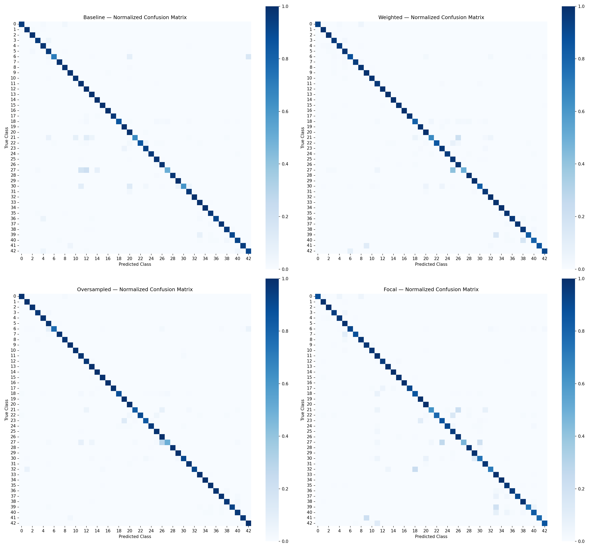
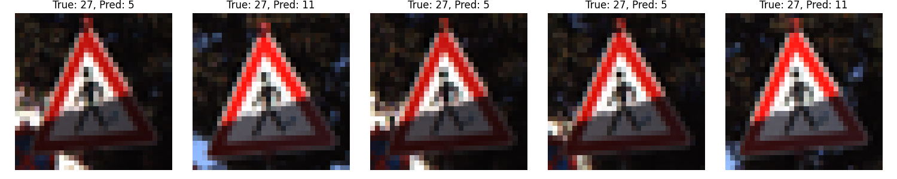

# Tackling Class Imbalance in Traffic Sign Recognition: A Controlled Study on GTSRB

**A systematic comparison of four class-imbalance mitigation strategies for CNN-based traffic sign classification**

---

## Abstract

Traffic sign recognition is a core part of driver assistance systems and self-driving cars. The German Traffic Sign Recognition Benchmark (GTSRB) is one of the most common datasets used for this task. But GTSRB has a problem that most tutorials ignore. Some classes have far fewer images than others. Training samples per class range from 210 to 2,250. That is roughly a 10.7 to 1 ratio. Most public notebooks just report a single, high accuracy number and move on. This project looks deeper. It tests whether common imbalance fixing techniques actually help the underrepresented classes. It also checks what these techniques give up in return. We used a fixed CNN architecture. We used a fixed random seed. We used a fixed train and validation split across every experiment. Only the imbalance strategy changed each time. We tested class weighted loss, oversampling, and focal loss. Oversampling gave the only real improvement in macro F1, going from 0.936 to 0.952. Class weighting barely changed anything. Focal loss actually made things worse, dropping to 0.921. One class, Pedestrians, stayed hard to classify no matter what we tried. This suggests its difficulty comes from something more basic, like losing detail at low image resolution, rather than just having too few samples. We also ran into a real data analysis bug partway through the project. We include it here as a case study in why you should always cross check your results.

---

## 1. Introduction

Self-driving systems need to recognize traffic signs quickly and correctly. GTSRB is the standard dataset used to test this. It has 43 classes and about 50,000 images in total. A simple CNN can usually hit 97 percent accuracy or higher on this dataset without much effort.

That number sounds impressive. But it hides something important. GTSRB's classes are not equally represented. A model can score well overall while completely failing on the rarer sign types. In a safety critical setting, this matters a lot. Misclassifying a pedestrian sign or a dangerous curve sign is far more serious than misclassifying a common speed limit sign.

So the real question here is this. How do different imbalance fixing strategies affect performance on individual classes? And is there a trade off between helping rare classes and keeping overall performance high?

This project tries to answer that with a few things:

1. It measures and describes GTSRB's class imbalance in detail.
2. It runs a controlled comparison of four training strategies. Baseline, class weighted loss, oversampling, and focal loss. All using the same architecture.
3. It looks past overall accuracy and digs into per class results and confusion matrices.
4. It finds one class, Pedestrians, that resists every fix tried.
5. It honestly documents a bug found during analysis, and how it got caught and corrected. Debugging and double checking your work is just as much a part of research as building the model.

---

## 2. Related Work

Class imbalance has been studied for a long time in machine learning. A few common approaches show up again and again.

Cost sensitive learning, or class weighting, scales the loss for each class based on how rare it is. Rare class mistakes get penalized more.

Resampling means either oversampling the minority classes or undersampling the majority ones, to even out the training data.

Focal loss, from Lin et al. in 2017, was first built for object detection. It down weights easy examples and puts more focus on the hard ones. Hard examples often overlap with minority classes, which is why focal loss gets used for imbalance too.

There is also decoupled training, from Kang et al. in 2020. This separates the feature learning stage from the classifier stage. You train the backbone on the full dataset first, then rebalance just the final classification layer.

Most GTSRB tutorials skip all of this. They report accuracy and stop there. That gap is what this project is trying to fill.

---

## 3. Dataset and Exploratory Analysis

GTSRB comes with three parts.

**Train** holds the training images and their metadata, listed in Train.csv, spread across 43 classes.

**Test** is a separate held out set with true labels in Test.csv.

**Meta** has one sample image per class plus some class level metadata in Meta.csv.

### 3.1 Class Imbalance

Counting images per class showed a clear imbalance. The smallest classes, 0, 19, and 37, had only 210 images each. The largest class, class 2, had 2,250. That works out to about a 10.7 to 1 ratio between the biggest and smallest class.


*Figure 1. Sorted class distribution across all 43 GTSRB classes. The imbalance is a smooth, gradual slope, not just a few extreme outliers.*

### 3.2 What Are the Rare Classes Actually?

Looking up the actual sign names for the rarest class IDs showed something interesting. The imbalance is not random. It reflects how often these signs actually appear in real traffic.

The rarest classes tend to fall into a few groups. There are "end of restriction" signs, like end of speed limit or end of no passing, which naturally show up less often than the restriction itself. There are rare warning signs, like dangerous curves or bumpy road signs, tied to less common road conditions. And there is one very specific speed limit, 20 km/h, which is just uncommon in general.

So the imbalance in GTSRB is not a data collection accident. It mirrors how often these signs actually occur on real roads.

### 3.3 Data Preparation

Images were resized to 32 by 32 by 3 and normalized to a 0 to 1 range.

Labels were loaded directly from Train.csv and Test.csv, not from folder names, to keep things consistent.

An 80 20 stratified train validation split was used, with a fixed random state of 42, so class proportions stayed the same in both sets.

The final shapes ended up being 31,367 training images, 7,842 validation images, and 12,630 test images.

---

## 4. Methodology

### 4.1 Keeping Things Fixed

To make sure any difference in results actually came from the imbalance strategy, everything else was kept identical across experiments.

The architecture stayed the same every time. The random seed, 42, was reset right before building each model, so weight initialization matched exactly. The train validation split stayed the same. Training settings stayed the same too. Adam optimizer, batch size 64, up to 30 epochs, early stopping with patience 5 watching validation loss, and a checkpoint saving the best model.

Only the imbalance strategy changed between runs. That is the one variable in this experiment.

### 4.2 Architecture

A small custom CNN was used, which fits GTSRB's tiny 32 by 32 images well and avoids the overfitting risk of a much bigger network.

It has 4 convolutional blocks, going 32, 64, 128, then 256 filters. Each block has batch normalization, a ReLU activation, and max pooling. After the last block there is global average pooling instead of flattening, which keeps the parameter count low. Then a dropout layer at 0.4, followed by the final dense softmax layer for all 43 classes.

### 4.3 The Four Experiments

**Baseline** used plain categorical cross entropy with no adjustment at all.

**Weighted** used the same loss, but with class weights computed using sklearn's balanced setting. This gives rare classes more weight during training.

**Oversampled** kept the loss unchanged, but resampled the training data itself. Every class was resampled with replacement up to 1,800 images, matching the largest class. This brought the total training set up to 77,400 images. The validation and test sets were left untouched, since evaluation needs to reflect the real, imbalanced world.

**Focal** replaced cross entropy entirely with focal loss, using gamma equal to 2.0.

### 4.4 How Results Were Measured

Overall accuracy hides a lot when data is imbalanced. A model can score high while still failing on minority classes. So this project relies mainly on a few other things.

Macro F1 averages the F1 score across all classes equally, no matter their size. This is the main number used to compare models.

Per class recall shows exactly which classes got better or worse under each strategy.

Confusion matrices, normalized by row, show where mistakes are actually happening, not just how many there are.

---

## 5. Results

### 5.1 Overall Comparison

| Model | Macro-F1 | Change vs. Baseline |
|---|---|---|
| Baseline | 0.936 | none |
| Weighted | 0.938 | +0.002 |
| Oversampled | 0.952 | +0.016 |
| Focal | 0.921 | -0.015 |

Oversampling was the only technique that gave a real, consistent improvement. Class weighting barely moved the needle. Focal loss actually did worse than doing nothing at all.

### 5.2 Confusion Matrices


*Figure 2. Row normalized confusion matrices for all four models. The oversampled model looks visibly cleaner than the rest, matching its higher macro F1 score. The focal model shows more scattered confusion, especially around classes 21, 22, 27, 30, and 32.*

### 5.3 The One Class That Would Not Improve: Class 27, Pedestrians

Across every single model, class 27, Pedestrians, stayed the worst or close to the worst performer.

| Model | Recall (Class 27) |
|---|---|
| Baseline | 0.500 |
| Weighted | 0.500 |
| Oversampled | 0.500 |
| Focal | 0.467, even worse |

Nothing improved this class. Focal loss even made it slightly worse. Looking through the misclassified samples by hand showed why. The images themselves were blurry and hard to make out at 32 by 32 resolution. It looks like the model just does not have enough fine detail to learn what makes this class distinct, no matter how the data or loss gets adjusted.


*Figure 3. Examples of misclassified class 27 test images, showing the low resolution that likely limits what the model can learn here.*

---

## 6. A Data Analysis Bug, and How It Got Caught

While going through the results, an early version of the per class comparison table pointed to something dramatic. Both the weighted model and the oversampled model seemed to badly damage class 18, general caution. Recall dropped from 0.941 at baseline down to 0.500 for weighted and 0.517 for oversampled. Two completely different techniques, almost the exact same collapse.

### 6.1 Catching It

That kind of coincidence felt off. Two unrelated methods breaking the same class by almost the same amount did not add up. So instead of trusting the number, the confusion matrix for class 18 was checked directly.

```
Class 18 confused with (oversampled model):
  predicted as class 18: 345 times
  predicted as class 27: 8 times
  ...
```

Out of about 390 test samples, 345 were classified correctly. That puts the real recall around 0.88 to 0.90. Nowhere close to the 0.517 shown in the table. That gap made it clear the table was wrong, not the model.

### 6.2 Finding the Cause

The bug turned out to be a classic pandas issue with row alignment.

First, the comparison_df table was built and then immediately sorted by train_count. This reordered the rows away from their natural class order, 0 through 42.

Later, recall values for the weighted and oversampled models were added using .values, like this.

```python
comparison_df["recall_weighted"] = per_class_recall_w.values
```

The problem is that .values assigns by row position, not by class label. Since per_class_recall_w was still in class order 0 to 42, but comparison_df had already been reordered by train_count, every new column ended up lined up with the wrong class. Nothing threw an error. It just silently put the wrong number next to the wrong class.

### 6.3 Fixing It

The fix was simple once the cause was clear. Build the table with all columns added while the rows are still in natural class order, and only sort at the very end, just for display.

```python
comparison_df = pd.DataFrame({
    "class": range(NUM_CLASSES),
    "train_count": per_class_count,
    "recall": per_class_recall.values,
})  # do not sort here, keep class order 0 to 42 so later columns line up correctly

comparison_df["recall_weighted"] = per_class_recall_w.values       # safe now
comparison_df["recall_oversampled"] = per_class_recall_o.values    # safe now

comparison_df_sorted = comparison_df.sort_values("train_count")    # sort only for display
```

After fixing this, class 18's actual recall changes turned out small and unremarkable. It went from 0.859 to 0.815 for weighted, and 0.859 to 0.885 for oversampled. That matched the confusion matrix numbers. The earlier "catastrophic collapse" finding was dropped, since it never really happened.

The lesson here is simple. If a result looks too clean, or too much of a coincidence, it is worth double checking before you believe it. In this case, the confusion matrix, built straight from the model's raw predictions, was untouched by the bug and served as the source of truth.

---

## 7. Discussion

**Why did oversampling work best?** By balancing the training data itself, the model sees a genuinely even signal throughout training. It does not distort the gradient the way loss reweighting can. Training curves for the oversampled model were also more stable than the weighted model. The weighted model had sharp, temporary drops in validation accuracy, dropping to 0.65 and 0.91 in a couple of epochs. That is likely because class weighting makes individual batches with rare class samples push much larger updates, which makes training less smooth.

**Why did focal loss do worse?** GTSRB is already a fairly easy, well separated dataset once trained normally. The baseline alone hits about 97 percent raw accuracy. Focal loss is built to down weight easy examples and focus on hard ones. But if there are not many genuinely hard examples to begin with, that mechanism seems to add noise instead of helping. The default gamma of 2.0 may also have just been too aggressive for this setup.

**Why did class 27 resist everything?** The fact that it stayed weak across four very different strategies points to something deeper than sample count. At 32 by 32 resolution, the fine details that separate this class from others may simply not survive the downsampling.

### Limitations

Each model was only trained with one random seed. Even with the seed fixed, some GPU operations are not fully deterministic, and small recall differences showed up between notebook reruns. So these results should be read as a strong signal, not an exact number. Running multiple seeds and reporting a mean and standard deviation would make this stronger.

Images were used at a fixed 32 by 32 resolution. A higher resolution might help with the class 27 issue, but that was outside the scope here.

Only one focal loss gamma value, 2.0, was tested. A small sweep over different gamma values might give a fairer picture of what focal loss can actually do here.

---

## 8. Conclusion and Future Work

This project shows that not every imbalance fixing technique actually helps. Some, like focal loss in this case, can even make things worse. Oversampling gave the most reliable improvement in macro F1, and without the training instability seen with class weighting. Still, no technique tested could fix one specific class. That points to a resolution and feature learning limit, not just a lack of data.

A few directions for future work:

Running multiple seeds and reporting mean and standard deviation, for more statistical confidence.

Using Grad-CAM or saliency maps to actually see what the network focuses on for hard classes like class 27.

Trying a two stage, decoupled training approach. Train the backbone on the full imbalanced data first, then fine tune just the classifier head on a balanced subset.

Testing at a higher input resolution, to see if class 27's difficulty is really a resolution problem.

---

## Tech Stack

TensorFlow and Keras, NumPy, Pandas, scikit-learn, Matplotlib, Seaborn

## References

1. Lin, T. Y., Goyal, P., Girshick, R., He, K., and Dollar, P. (2017). Focal Loss for Dense Object Detection. ICCV.
2. Kang, B., Xie, S., Rohrbach, M., Yan, Z., Gordo, A., Feng, J., and Kalantidis, Y. (2020). Decoupling Representation and Classifier for Long-Tailed Recognition. ICLR.
3. Stallkamp, J., Schlipsing, M., Salmen, J., and Igel, C. (2012). Man vs. Computer: Benchmarking Machine Learning Algorithms for Traffic Sign Recognition. Neural Networks.
